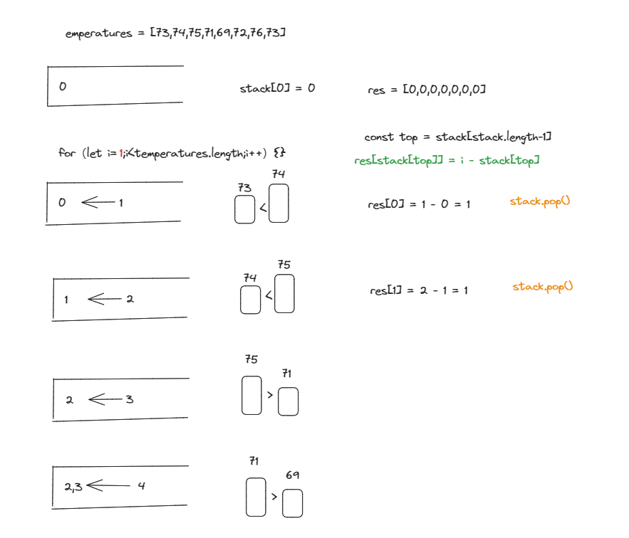
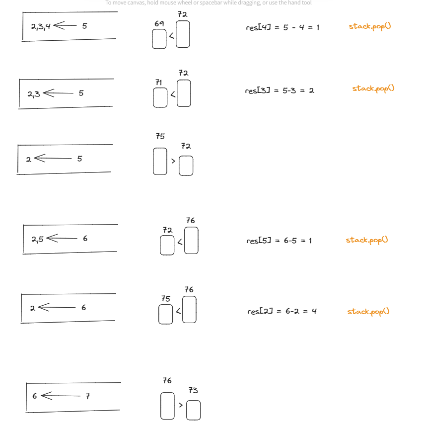

<a href="https://leetcode.com/problems/daily-temperatures/">Daily Temperatures</a>

Basic idea: Subtracting subscripts of arrays
emperatures = [73,74,75,71,69,72,76,73]
res = [1,1,4,2,1,1,0,0]

The problem becomes how to determine the number to be subtracted and the number to be subtracted
Using monotonic stacks to solve this issue
``` js
var dailyTemperatures = function(temperatures) {
    const n = temperatures.length;
    const res = Array(n).fill(0);
    const stack = [];  
    stack.push(0);
    for (let i = 1; i < n; i++) {
    
        const top = stack[stack.length - 1];
        if (temperatures[i] < temperatures[top]) {
            stack.push(i);
        } else if (temperatures[i] === temperatures[top]) {
            stack.push(i);
        } else {
            while (stack.length && temperatures[i] > temperatures[stack[stack.length - 1]]) {
                const top = stack.pop();
                res[top] = i - top;
            }
            stack.push(i);
        }
    }
    return res;
};
```

</img>
</img>