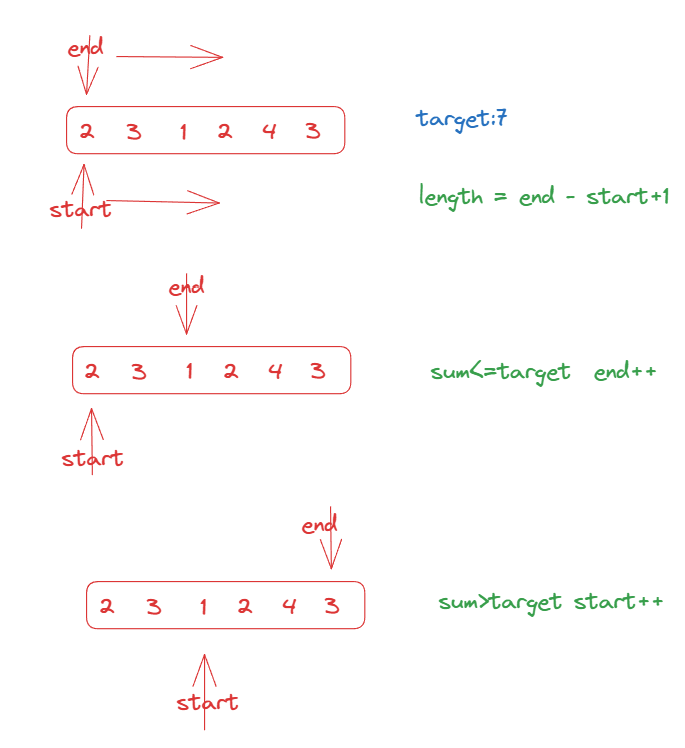

<a href="https://leetcode.com/problems/minimum-size-subarray-sum/">209.Minmium Size Subarry Sum</a>

``` js
var minSubArrayLen = function (target, nums) {
    let start = 0, end = 0
    let res = Infinity
    let sum = 0
    while (end < nums.length) {
        sum += nums[end]
        while (sum >= target) {
            res = Math.min(res, end - start + 1)
            sum -= nums[start]
            start++

        }
        end++

    }
    return res === Infinity ? 0 : res
};
```

</img>