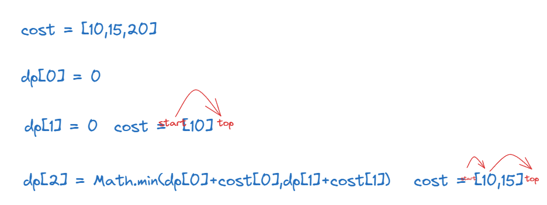

``` js
var minCostClimbingStairs = function(cost) {
    let dp = []
    dp[0] = 0
    dp[1] = 0
    // dp[2] = Math.min(dp[0]+cost[0],dp[1]+cost[1])
    
    for(let i=2;i<=cost.length;i++){
        dp[i] = Math.min(dp[i-1]+cost[i-1],dp[i-2]+cost[i-2])
    }
    return dp[cost.length]
};
```
</img>
 
Arrows pointing to nodes representing passing through