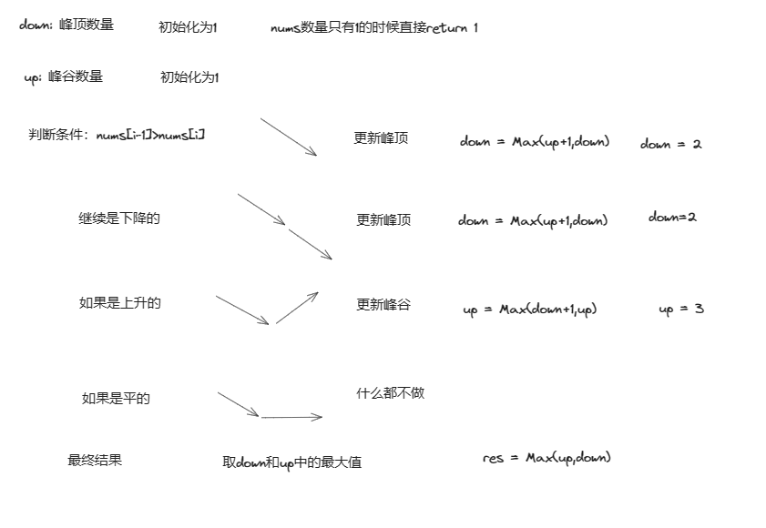

# 1贪心
```js
var wiggleMaxLength = function (nums) {
    if (nums.length <= 1) {
        return nums.length
    }
    // 思路：判断prediff和curdiff
    // prediff>=0&&curdiff<0 || prediff<=0&&curdiff>0 result ++
    // 为了满足上述的判断，使逻辑简单化，假设默认nums增加一个平节点，及默认prediff=0,默认的result = 1
    let result = 1
    let prediff = 0
    let curdiff = 0
    for (let i = 0; i < nums.length - 1; i++) {//注意这里的nums.length-1
        curdiff = nums[i+1]-nums[i]
        if (prediff >= 0 && curdiff < 0 || prediff <= 0 && curdiff > 0) {
            result++
            // 注意这里的prediff = curdiff放置在if判断中。考虑情况 单调 序列中存在平序列，prediff只在摆动变化时更新
            prediff = curdiff
        }

    }
    return result
};
```

1. 考虑 preDiff=0 情况
2. 考虑preDiff 只有在摆动变化时才重新赋值

当给定一个数组 nums 时，该函数用于计算数组中最长摆动子序列的长度。
首先，函数会检查数组的长度，如果长度小于等于 1，则直接返回数组的长度。
接下来，函数定义了三个变量：
result：用于记录最长摆动子序列的长度，初始值为 1。
preDiff：用于记录前一个元素与当前元素的差值，初始值为 0。
curDiff：用于记录当前元素与下一个元素的差值。
然后，函数通过遍历数组来计算最长摆动子序列的长度。在遍历过程中，对于每个元素，计算当前元素与下一个元素的差值，并将结果赋给 curDiff。
接着，通过判断 preDiff 和 curDiff 的符号来确定是否构成了摆动子序列。如果前一个差值 preDiff 小于等于 0 且当前差值 curDiff 大于 0，或者前一个差值 preDiff 大于等于 0 且当前差值 curDiff 小于 0，则说明构成了摆动子序列。此时，将结果 result 加 1，并更新 preDiff 为当前差值 curDiff。
最后，返回最终的结果 result，即最长摆动子序列的长度。
这段代码的思路是通过遍历数组，判断相邻元素之间的差值的符号来确定是否构成了摆动子序列，并计算最长摆动子序列的长度。

# 动态规划

``` js
var wiggleMaxLength = function (nums) {
    if (nums.length == 1) {
        return 1
    }
    let down = 1, up = 1
    for (let i = 1; i < nums.length; i++) {
        // 注意这里从1开始遍历，即从第二个数开始遍历
        if (nums[i - 1] > nums[i]) {
            down = Math.max(up + 1, down)
        }
        if (nums[i - 1] < nums[i]) {
            up = Math.max(down + 1, up)
        }
    }

    return Math.max(up, down)

}; 
```


动态规划，直接一个一个举例
难点在于如何想到 down = Math.max(up + 1, down)

