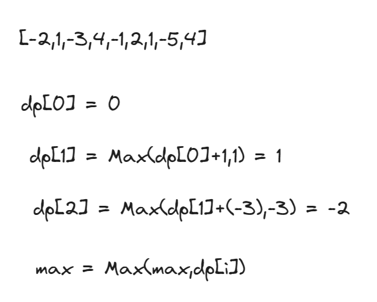

贪心
``` js
var maxSubArray = function (nums) {
    let count = 0
    let sum = -Infinity
    for (let i = 0; i < nums.length; i++) {
        count+=nums[i]
        if (count > sum) {
            sum = count
        }
        if (count < 0) {
            count = 0
        }
    }
    return sum

};
```

1. count记录当前
2. 如果大于目前的sum，就把值赋给sum
3. 如果<0，就直接变成0

动态规划

``` js
const maxSubArray = nums => {
    // 数组长度，dp初始化
    const len = nums.length;
    let dp = new Array(len).fill(0);
    dp[0] = nums[0];
    // 最大值初始化为dp[0]
    let max = dp[0];
    for (let i = 1; i < len; i++) {
        dp[i] = Math.max(dp[i - 1] + nums[i], nums[i]);
        // 更新最大值
        max = Math.max(max, dp[i]);
    }
    return max;
};
```

动态规划的题往往不好理解，此时一个个举例是不错的解题方法
