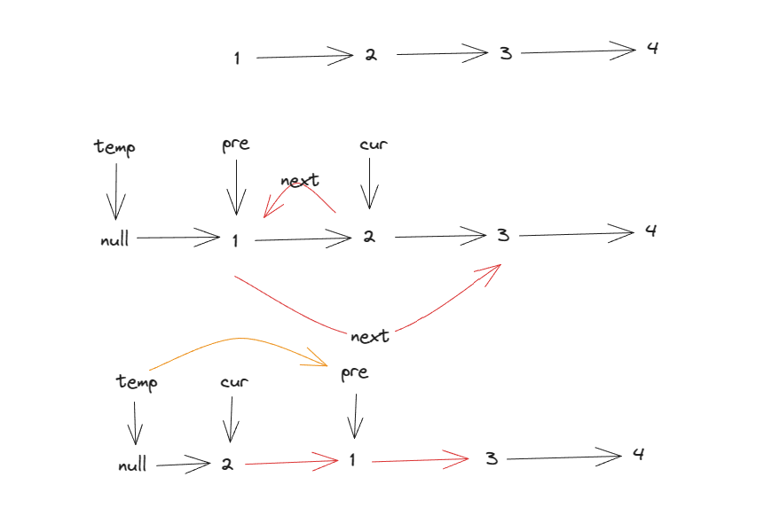

<a href="https://leetcode.com/problems/swap-nodes-in-pairs/description/"></a>

``` js
var swapPairs = function (head) {
    let ret = new ListNode(0, head), temp = ret
    while (temp.next && temp.next.next) {
        let cur = temp.next.next, pre = temp.next
        pre.next = cur.next
        cur.next = pre
        temp.next = cur
        temp = pre

    }
    return ret.next
};
```

