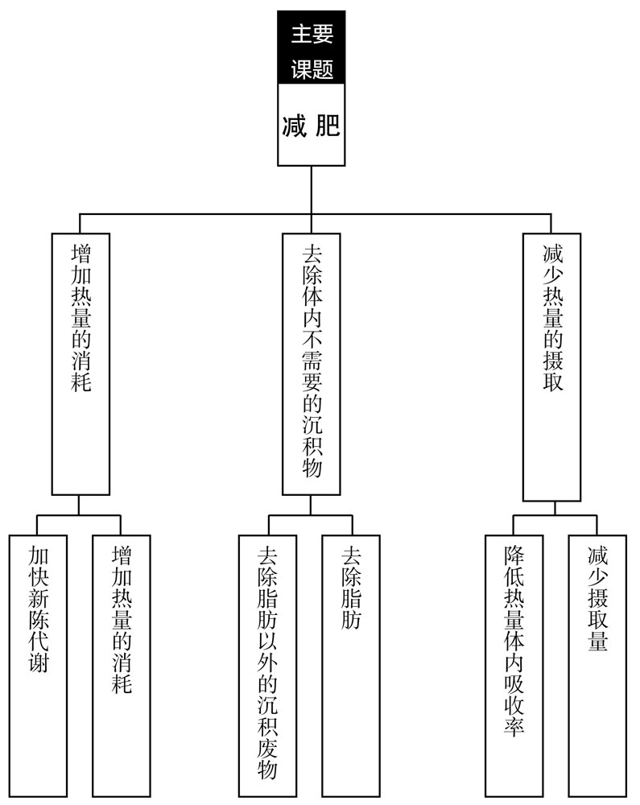

# 先讲结论
## 遵循PREP模式
- POINT =结论
- REASON =依据
- EXAMPLE =具体事例
- POINT =重申结论后结束
## Talk Straight直入主题
## 用数据、事实说话
## 用数据、逻辑说话
- 世界的通用语言是逻辑和数据
## 逻辑先行
## 让对方听得懂
- 以对方“毫不知情”为前提，构建逻辑，组织语言
## 配合对方的步调
## 充分理解对方的期望值
- 不断地超越对方的期望值是商业的基础
## 超越上司的期待

# 逻辑思考技巧
## 思考方式
## 熟练运用逻辑树（重要）
- 逻辑树、结构化思维（MECE）、问题解决法
- ### 逻辑树的四个益处
- 1受用一生
- 2可以俯瞰问题全貌
- 3学会放弃
- 4加快做决定的速度
#### 逻辑树图解

### 根据逻辑树解决问题的基本要点
- 1 整理、分解方法
- 2 对各种方法做数据分析
- 3 找出项目的重点
- 4 落实在行动方案上
### 参考书籍
- 《企业参谋》《企业参谋（续）》（大前研一著）
- 《问题解决专业法——思维与技能》（斋藤嘉则著）
- 《世界最简单的问题解决方法》（渡边健介著）
- 《三分钟搞懂问题解决的基本》（大石哲之著）
- 《麦肯锡教我的思考武器》（安宅和人著）
- 《用头脑思考》（伊贺泰代著）
### 如何练习才能熟练使用逻辑树
- 出色的逻辑树需要意见反馈
## “云—雨—伞”：提建议的基本原则
###  要区别事实、分析、行动
- （事实）“天空出现乌云。”
- （分析）“因为有乌云，可能会下雨。”
- （行动）“因为要下雨，所以带雨伞。”
### 加入“事实”“分析”“推荐的行动方案”这三个标题
## 假设性思考
- 先设想好工作的大致方向，而后再做具体的研究调查
- 按照预定的路线，锁定调查研究的关键点
- 调查分析就是对假设的检验
- 让假设→检验→反馈的循环快速运转
- 假设性思考提升做决定的速度
- 提前列出选项和条件

## 有主见地汲取信息
### 提高商务能力要有自己的想法
### 有主见地接触信息，才能获得学习的机会
### 不拘泥于正确答案，不要停止思考

## 探求问题本质的思考方式
### 需要呈现的不是“信息”，而是“本质”
### 挖掘本质要靠更高一层的视角而非信息量

# 资料制作技巧
## 文书写作的基础——会议记录法
### 所有资料制作都从会议记录开始
### 会议记录需要简洁地记录会议决策
- 会议记录
1. 记录决策事项、确认事项，需要向相关人员确认决策的内容
2. 记录决策事项，作为日后的证据
### 记录未决定的事项，和下次应决定的事项
- 
1. 日期时间
2. 地点参加人员
3. 本日内容安排（论点·议题）
- 有以上几条理所当然。以下四个是重点：
- 已决定的事项
- 未决定的事项（需要下次决定的问题）
- 需要确认的事项
- 下次会议之前的准备（负责人和截止日期）

## 最强的PPT制作方法
### PPT要简洁
- PPT要一页说明一个问题
#### PPT的基本结构：数据或事实+分析和意见
- ①容易理解
- ②容易听懂
- ③容易快进
- ④方便多次利用
### 试着做一页一个问题的PPT
- ①根据部分
- ②分析和主张部分
- ③每页的标题
- ④出处
### Excel、PPT：速度定输赢
### 缩短资料制作时间，就有时间思考
### 熟练使用快捷键
### PPT和Excel的秘诀：外企咨询和外资金融企业都在用

### 从预设结果推算出工作计划
- 首先，从结果倒推，找出必要的工作
#### 制作“空包”的好处
- ①可以预想最终成果的轮廓
- ②能够提炼出必需的工作内容
- ③可以列出行动计划
- ④列出每项工作后，就能同时委托多人同时展开工作
- ⑤没有遗漏
##### 无论做什么事情，都要培养从最终成果来逆推的习惯。

### 检索型阅读法
- 咨询师的阅读法
- 明确读书目的
- 把书籍当作资料文件，有选择地阅读

### 抓重点——让工作速度倍增
- 聚焦关键点，深入分析，抛开多余部分
- 区别重要问题和细枝末节

# 读后感：
1. 这是一本获得感非常强的书，用处颇多
2. 其实提到的逻辑树方法，记忆ppt的制作技巧，使我眼前一亮
3. 文中提到的一些工作方法给我在生活工作学习中带来了一些启发，
4. 书中的内容，让我对工作有了新的认识
